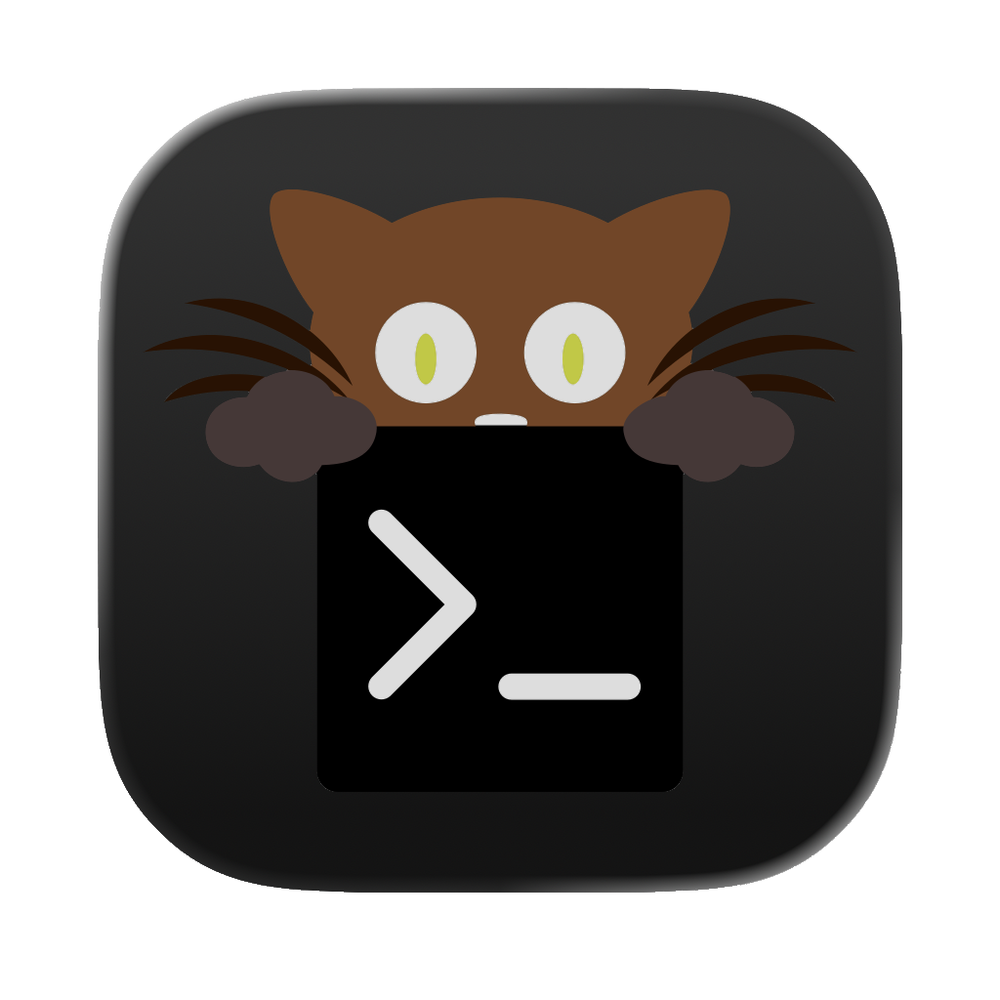

<h1 align="center">menzych</h1>

  Чилловый парень, который любит писать код 
  и делать всякую ненужную фигню.

  <a href="https://menzych.github.io">Сайт</a> ·
  <a href="https://github.com/menzych">GitHub</a>

---

### Обо мне

Чилловые парни, они как ветер. Бывают приятными и весёлыми, а бывают…

Я как раз один из таких: бываю весёлым, а иногда злюсь на кого‑то.  
Именно в такие моменты меня спасает программирование — оно успокаивает.  
Монотонно верстать сайты вечерком.  
Программированием заинтересовался с 9 лет: начинал со Scratch, потом Python, потом HTML.  
Так и дорос до текущего уровня.

---
<h1 align="center">Рабочее пространство

  

  

  

---

  <picture>
    <source media="(prefers-color-scheme: dark)" srcset="https://raw.githubusercontent.com/menzych/menzych/refs/heads/output/github-contribution-grid-snake-dark.svg" />
    <source media="(prefers-color-scheme: light)" srcset="https://raw.githubusercontent.com/menzych/menzych/refs/heads/output/github-contribution-grid-snake.svg" />
    
  </picture>

